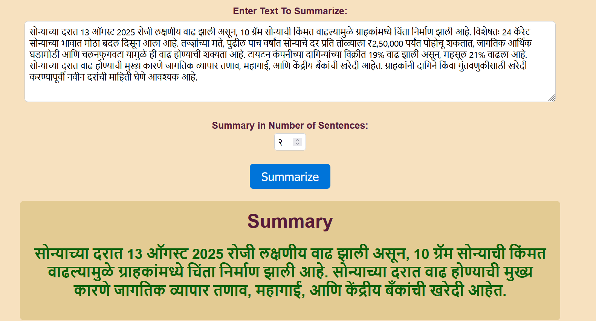
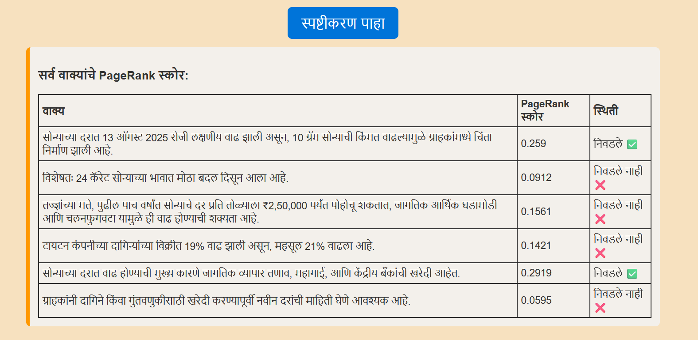

# MarathiTextSummarizer  

An NLP-based project for **automatic summarization of Marathi text**.  
It uses **text processing, PageRank, and extractive summarization techniques** to identify the most important sentences and generate a concise summary.  
The project also provides an explanation feature that shows how sentences were scored and selected.  

---

## ✨ Features
- Accepts input Marathi text from the user.  
- Summarizes text into a desired number of sentences.  
- Prevents choosing more summary sentences than the original text.  
- Shows PageRank score explanation for each sentence.  
- Simple Flask-based web UI with Marathi interface.  

---

## 🚀 Running on your machine


### 1️⃣ Create a virtual environment  
```bash
python -m venv env
```   

### 2️⃣ Activate the environment
```bash
.\env\Scripts\activate
```

### 3️⃣ Install dependencies
```bash
pip install -r requirements.txt
```

### 4️⃣ Run the Flask app
```bash
python app.py
```

## SCREENSHOTS OF UI
 

 

 
 